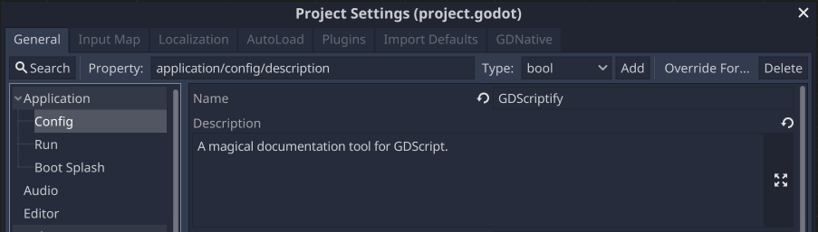
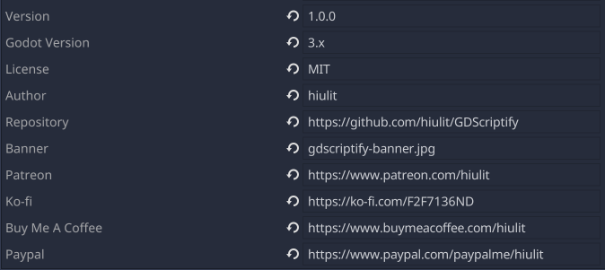
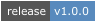
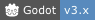
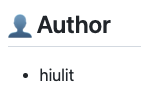
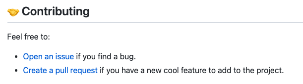
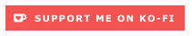
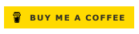
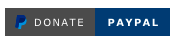

# Generate a README file

> ⚠️ GDScriptify will generate a `README` file if there's **only 1 GDScript file** in the Godot's project folder.

GDScriptify will look at the **Applicaction/Config** section in **Projects Settings** to add:

- Title
- Description

GDScriptify will look for some files to create some sections:

- `LICENSE`
- `CHANGELOG.md`

## Spice it up!

Optionally, some fields can be added to the **Applicaction/Config** section in **Projects Settings** to make the `README` look better.

### Table of contents

- [Badges](#badges)
- [Sections](#sections)
  - [Author](#author)
  - [Contributing](#contributing)
  - [Support](#support)

### Badges

The badges go right under the title.

|Name|Description|Output|
|:-|:-|:-|
|`config/version`|The version of the project (e.g. `1.0.0`).||
|`config/godot_version`|The version of Godot the project supports (e.g `3.x`).||
|`config/license`|The type of license of the project (e.g. `MIT`).||

### Banner

The banner goes right after the description.

|Name|Description|Output|
|:-|:-|:-|
|`config/banner`|The path to the image that will be used as a banner.||

### Sections

#### Author

|Name|Description|Output|
|:-|:-|:-|
|`config/author`|The author/s of the project. Multiple authors must be comma-separated. (e.g. `hiulit` or `hiulit, another person, etc.`)||

#### Contributing

|Name|Description|Output|
|:-|:-|:-|
|`config/repository`|The URL of the project's repository.||

#### Support

|Name|Description|Output|
|:-|:-|:-|
|`config/patreon`|The URL to Patreon.||
|`config/ko-fi`|The URL to Ko-fi.||
|`config/buy_me_a_coffee`|The URL to Buy Me a Coffee.||
|`config/paypal`|The URL to PayPal.||
